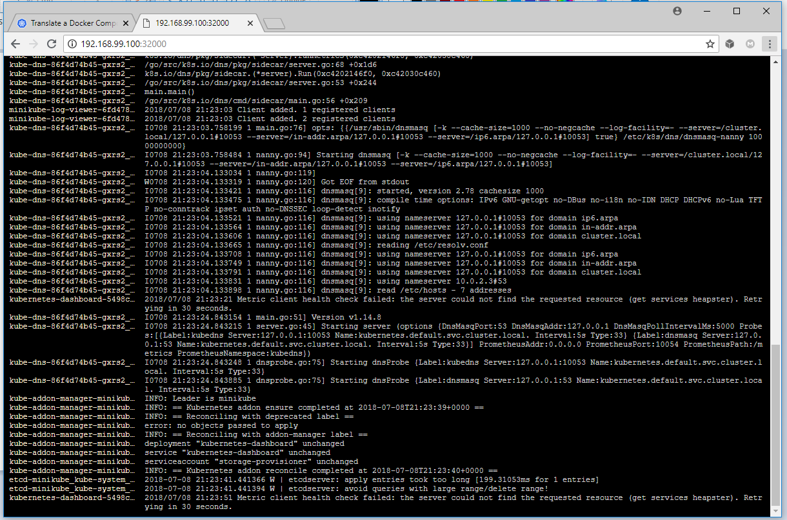

# minikube-log-viewer
Lightweight Minikube Log Viewer



Usage (Mac + Linux):
```
kubectl create -f https://raw.githubusercontent.com/ivans3/minikube-log-viewer/master/deployment-and-service.yaml
echo The URL is http://$(minikube ip):32000/
```
And then visit the URL with your browser.

Features:
 * uses HTTP SSE (no indexer or indexing delay)
 * uses xtail as the log collector
 * namespace filtering (use filename filter patterns such as *_yournamespace_*, and you can bookmark a link with a 'filename_filter_regexp' query string item to save the selection)

TODO:
 * search feature
 * pause/resume feature

